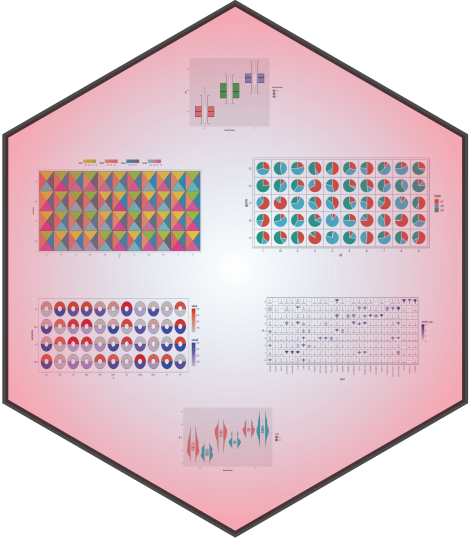

# jjPlot 

<!-- badges: start -->
  
  This **jjPlot** package may includes some funny **geom/stat** layer function to produce enjoyable graphs which is mainly based on **ggplot2**. Besides it will record my learning experience about **ggplot2** package. I will also add more useful functions to this package in the future.

<!-- badges: end -->
  
  ## Installation
  
  You can install the development version of jjAnno like so:
  
  ``` r
# install.packages("devtools")
devtools::install_github("junjunlab/jjPlot")
```

## Citation

> Jun Z (2022). *jjPlot: Some Geom/Stat Functions to Produce Funny Graphs.*  https://github.com/junjunlab/jjPlot, https://junjunlab.github.io/jjPlot-manual/
  
## Example
  
Eaxmples showed here:
  


## Documentation

More examples and details see:
  
> **https://junjunlab.github.io/jjPlot-manual/**
  
